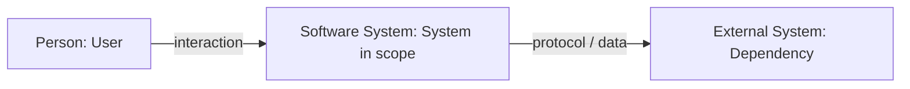
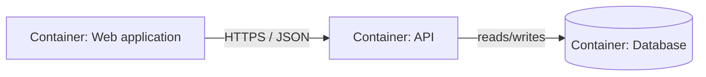
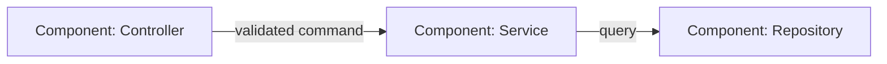
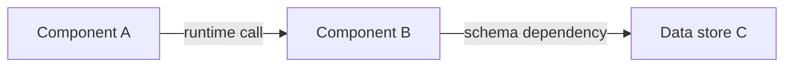

# aif-explore Ultra Research Bundle

Use this reference only for an explicit `/aif-explore ultra <topic>` request.
Ultra research is a durable analysis bundle, not an implementation plan. Its
purpose is to preserve evidence, system boundaries, decisions, and unresolved
questions without forcing every topic through the same documentation set.

## Language and Compatibility Tokens

Write human-readable headings, table labels, notes, and prose in the resolved
`artifact_language`, applying `technical_terms_policy`. Keep these compatibility
tokens exact because discovery and drift checks depend on them:

- filenames and relative links
- `<!-- aif:research-mode:ultra -->`, `<!-- aif:active-summary:start -->`,
  `<!-- aif:active-summary:end -->`, `<!-- aif:sessions:start -->`, and
  `<!-- aif:sessions:end -->`
- `## Artifact Index`, `## Active Summary (input for /aif-plan)`, and
  `## Sessions`
- metadata keys `Topic:`, `Slug:`, `Updated:`, and `Status:`
- status values `active`, `paused`, `superseded`, `proposed`, and `accepted`
- English slugs, Mermaid syntax, traceability IDs, ADR numbers, paths,
  commands, code identifiers, package/API names, and raw errors

Values after human-readable fields such as `Topic:` use `artifact_language`.
The English slug and the listed status values are stable machine identifiers,
not untranslated prose.

## Bundle Location and Discovery

Derive the bundle root from the configured legacy research file:

```text
research_bundles_dir = <parent directory of paths.research>/research/
bundle = <research_bundles_dir>/<topic-slug>/
```

With the default `paths.research: .ai-factory/RESEARCH.md`, a billing study is
stored at `.ai-factory/research/billing-ledger/`.

`<topic-slug>` must be a concise, logical English ASCII slug:

- lowercase kebab-case, normally 2-6 meaningful words
- translate the topic to English when the user writes in another language
- prefer the domain/problem (`billing-ledger`, `partner-order-sync`) over generic
  names such as `research`, `analysis`, `new-topic`, or a date
- reuse a matching marked bundle instead of creating a synonym directory

A direct child directory is an AI Factory ultra research bundle only when its
`INDEX.md` contains the exact marker `<!-- aif:research-mode:ultra -->`. Never
claim or overwrite an unmarked directory that happens to have the same slug.
Use `Status: active`, `paused`, or `superseded` in the index. Automatic consumers
consider only `active` bundles; a user may explicitly reference a non-active
bundle, but the consumer must warn before using it as current context.

## Adaptive Layout

Every bundle has the same minimum shape:

```text
research/<topic-slug>/
├── INDEX.md
└── RESEARCH.md
```

Add only justified optional artifacts:

```text
research/<topic-slug>/
├── INDEX.md
├── RESEARCH.md
├── C4-CONTEXT.md
├── C4-CONTAINER.md
├── C4-COMPONENT-<scope>.md
├── DEPENDENCY-GRAPH.md
└── ADR-0001-<decision-slug>.md
```

Do not create empty placeholders. A small, local, reversible topic should remain
the two-file bundle. Use these evidence-based inclusion signals:

| Artifact | Include when | Skip when |
|----------|--------------|-----------|
| `C4-CONTEXT.md` | The topic crosses a user, external system, partner, or trust boundary; system scope is otherwise ambiguous | The change is wholly inside one already-understood system |
| `C4-CONTAINER.md` | Two or more applications, services, data stores, queues, or deployable/runtime units participate | One runtime/module owns the whole flow |
| `C4-COMPONENT-<scope>.md` | Responsibilities or calls among three or more components inside one container are materially unclear | A container diagram or prose already explains the internal flow |
| `ADR-NNNN-<slug>.md` | A selected decision is material, has credible alternatives, and is costly to reverse | The item is still an open question, obvious, or a local implementation detail |
| `DEPENDENCY-GRAPH.md` | Three or more relevant components/packages/services have non-linear dependencies, cycles, critical ordering, or coupling risk | Dependencies are a short linear chain obvious from `RESEARCH.md` |

Never generate C4 Level 4/code diagrams by default. Exact code structure belongs
in an implementation plan; add a component view only when it clarifies a real
analytical boundary.

`INDEX.md` must link every generated artifact and record why each optional file
was included. Files that are not linked from its Artifact Index are not part of
the bundle. If a prior optional artifact becomes obsolete, retain it and mark it
superseded in the index/file, or ask before removing it.

## Sources of Truth

- `INDEX.md` is the manifest, navigation entrypoint, and coverage rationale.
- `RESEARCH.md` retains the legacy Active Summary and Sessions contract. Its
  Active Summary is the only bundle content copied into a plan's
  `## Research Context` and hashed for drift detection.
- C4, ADR, and dependency files explain evidence and rationale. Any conclusion
  that changes requirements or planning scope must also be reflected compactly
  in the `RESEARCH.md` Active Summary before `/aif-plan` consumes it.
- Do not duplicate full findings across files; link to the owning artifact.

## `INDEX.md` Template

```markdown
<!-- aif:research-mode:ultra -->
# Research Index: [Topic]

Topic: [human-readable topic]
Slug: [english-topic-slug]
Updated: YYYY-MM-DD HH:MM
Status: active

## Purpose
[One sentence defining the question and boundary of this research.]

## Artifact Index

| Artifact | Purpose | Why included | Status |
|----------|---------|--------------|--------|
| [RESEARCH.md](RESEARCH.md) | Active summary and session history | Required | active |
<!-- Add optional artifact rows only after their inclusion gates pass. -->

## Reading Order
1. [RESEARCH.md](RESEARCH.md)
<!-- Add only the generated optional artifacts, in the order they should be read. -->

## Traceability (optional)

| ID | Finding / requirement | Evidence | Decision or artifact |
|----|-----------------------|----------|----------------------|
| REQ-001 | [...] | `src/...` / issue / URL | [ADR-0001-decision](ADR-0001-decision.md) |
```

Omit `Traceability` for a small two-file bundle. Add stable `REQ-*`, `NFR-*`,
`RISK-*`, or `DEC-*` IDs only when several artifacts or a formal handoff need
cross-references; do not add IDs to make a simple note look formal.

## `RESEARCH.md` Template

This preserves compatibility with regular research and existing plan consumers:

```markdown
# Research: [Topic]

Updated: YYYY-MM-DD HH:MM
Status: active
Index: [INDEX.md](INDEX.md)

## Active Summary (input for /aif-plan)
<!-- aif:active-summary:start -->
Topic:
Goal:
Scope: [optional: in/out boundary when it matters]
Stakeholders: [optional: only material actors]
Constraints:
Requirements: [optional: functional/non-functional requirements established by evidence]
Decisions:
Risks: [optional: material delivery, operational, security, or data risks]
Open questions:
Success signals:
Next step:
<!-- aif:active-summary:end -->

## Sessions
<!-- aif:sessions:start -->
<!-- aif:sessions:end -->
```

Keep optional fields only when they add information. Append sessions exactly as
regular research does and preserve prior session history verbatim.

## C4 Templates

Use Mermaid `flowchart` syntax for portable rendering. Preserve C4 semantics in
the element/relationship tables even when a renderer cannot display Mermaid.
Every relationship must be directional and name the interaction or data moved.

### `C4-CONTEXT.md`

````markdown
# C4 System Context: [Topic]

Research: [INDEX.md](INDEX.md)
Scope: [system in focus]

## Diagram


## Elements
| Element | Type | Responsibility | Evidence |
|---------|------|----------------|----------|

## Relationships
| From | To | Interaction / data | Protocol / frequency | Evidence |
|------|----|--------------------|----------------------|----------|

## Boundary Notes
- Trust, ownership, compliance, or out-of-scope boundaries that affect the research.
````

### `C4-CONTAINER.md`

````markdown
# C4 Container View: [System]

Research: [INDEX.md](INDEX.md)
Parent context: [C4-CONTEXT.md](C4-CONTEXT.md)

## Diagram


## Containers
| Container | Technology | Responsibility | Data owned | Evidence |
|-----------|------------|----------------|------------|----------|

## Relationships
| From | To | Interaction / data | Failure concern | Evidence |
|------|----|--------------------|-----------------|----------|
````

### `C4-COMPONENT-<scope>.md`

````markdown
# C4 Component View: [Container / Scope]

Research: [INDEX.md](INDEX.md)
Parent container: [C4-CONTAINER.md](C4-CONTAINER.md)

## Diagram


## Components
| Component | Responsibility | Interface / data | Evidence |
|-----------|----------------|------------------|----------|

## Relationships and Constraints
| From | To | Contract | Constraint / risk | Evidence |
|------|----|----------|-------------------|----------|
````

If no parent C4 artifact was justified, replace its link with `Parent: none`;
never create a parent file only to satisfy the template.

## ADR Template

Number ADR files monotonically inside the bundle, starting at `0001`:

```markdown
# ADR-NNNN: [Decision]

Status: proposed | accepted | superseded
Date: YYYY-MM-DD
Research: [INDEX.md](INDEX.md)
Decision ID: DEC-NNN

## Context
[Evidence-backed forces and constraints.]

## Decision
[The selected option and its boundary.]

## Alternatives Considered
| Option | Benefits | Costs / risks | Why not selected |
|--------|----------|---------------|------------------|

## Consequences
- Positive: ...
- Negative: ...
- Follow-up / revisit trigger: ...

## Evidence
- `path`, issue, experiment, or source link
```

Omit `Decision ID` when the index does not use traceability IDs. A proposed ADR
records a preferred decision awaiting approval; an unresolved comparison stays
in `RESEARCH.md` Open questions and is not an ADR.

## Dependency Graph Template

````markdown
# Dependency Graph: [Topic]

Research: [INDEX.md](INDEX.md)

## Graph


## Edges
| From | To | Type | Why required | Risk / change impact | Evidence |
|------|----|------|--------------|----------------------|----------|

## Findings
- Critical path: ...
- Cycles / unwanted coupling: ...
- Safe separation point: ...
````

Use the graph for actual dependency direction, not a generic request flow. Put a
sequence or data-flow explanation in `RESEARCH.md` or the relevant C4 artifact.

## Bundle Integrity Gate

Before presenting or updating an ultra research bundle, verify:

1. `INDEX.md` contains the exact marker once and links `RESEARCH.md`.
2. `RESEARCH.md` contains intact Active Summary and Sessions markers.
3. Every Artifact Index link is relative, stays inside the bundle, and exists.
4. Every generated optional artifact is linked exactly once; no placeholder or
   orphan optional file was created.
5. Each optional artifact has a concrete inclusion signal from the matrix.
6. Claims distinguish repository/source evidence from inference and unknowns.
7. Material C4/ADR/dependency conclusions are reflected in the Active Summary
   before the bundle is handed to `/aif-plan`.
8. The bundle contains analysis only: no implementation task checklist and no
   writes outside the selected bundle.

When evidence is insufficient, record the gap in `Open questions` and omit the
optional artifact instead of filling a template with guesses.
